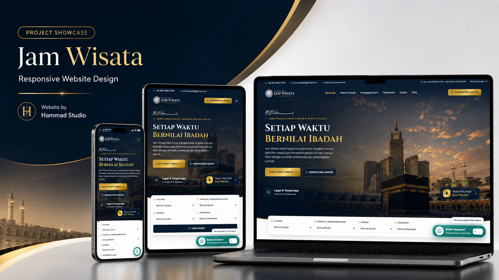

# Hammad Studio — Partner Ads Landing Page

Landing page conversion-focused untuk traffic Meta Ads Hammad Studio. Visitor dapat memahami layanan, melihat harga dan portfolio, lalu berkonsultasi langsung melalui WhatsApp partner.



## Live page

[Buka landing page di GitHub Pages](https://hmad28.github.io/LP-partner-ads/)

Contoh campaign dengan offer dinamis:

```text
https://hmad28.github.io/LP-partner-ads/?partner=demo-partner&service=lms&utm_source=meta&utm_campaign=lms
```

## Fitur utama

- Desain mobile-first dengan sticky WhatsApp CTA.
- Offer dinamis berdasarkan query `service`.
- Nomor dan identitas partner dikelola dari satu konfigurasi.
- Pesan WhatsApp berbeda untuk setiap layanan dan paket.
- Showcase project nyata Hammad Studio.
- Event analytics untuk Meta Pixel, GA4, dan Google Tag Manager.
- Campaign attribution untuk UTM, `fbclid`, dan `gclid`.
- Tidak memerlukan build step atau framework JavaScript.

## Offer dinamis

Gunakan query `service` untuk menyesuaikan headline, harga, benefit, CTA, dan pesan WhatsApp secara otomatis.

| Service | Offer | Harga mulai |
| --- | --- | ---: |
| `website` | Website Professional | Rp699rb |
| `cms` | Website + CMS | Rp1.199jt |
| `ecommerce` | E-Commerce | Rp1.699jt |
| `booking` | Booking System | Rp2.999jt |
| `lms` | LMS / Course System | Rp3.999jt |
| `business` | Business System | Rp3.499jt |

Contoh:

```text
?partner=demo-partner&service=ecommerce
```

Jika `service` kosong atau tidak dikenali, halaman menggunakan offer Website Professional.

## Konfigurasi partner

Data partner berada di [`config.js`](config.js). Tambahkan entry baru ke `window.HAMMAD_PARTNERS`:

```js
"slug-partner": {
  name: "Nama Partner",
  id: "PARTNER-ID",
  whatsapp: "628xxxxxxxxxx",
  active: true
}
```

Ketentuan konfigurasi:

- Nomor WhatsApp menggunakan format internasional tanpa `+`, spasi, atau tanda hubung.
- Nomor Indonesia diawali `62`, bukan `0`.
- Partner dengan `active: false` tidak dapat menerima CTWA.
- `partner_id` ikut dikirim dalam event analytics dan pesan WhatsApp.

Untuk GitHub Pages, pilih partner melalui query:

```text
?partner=slug-partner
```

Untuk hosting yang mendukung rewrite seperti Vercel, konfigurasi [`vercel.json`](vercel.json) juga menyediakan route:

```text
/offer/slug-partner?service=lms
```

## Tracking analytics

Halaman mengirim event berikut ke `window.dataLayer`. Jika tersedia, event yang sama juga diteruskan ke `gtag` dan `fbq`.

| Event | Trigger |
| --- | --- |
| `page_view` | Halaman selesai diinisialisasi |
| `view_package` | Card paket masuk viewport |
| `portfolio_view` | Showcase portfolio masuk viewport |
| `whatsapp_click` | CTA WhatsApp umum diklik |
| `package_whatsapp_click` | CTA pada paket tertentu diklik |

Payload menyertakan service aktif, partner ID, partner slug, UTM, `fbclid`, dan `gclid` jika tersedia pada URL.

## Menjalankan secara lokal

Project ini adalah static site. Jalankan web server sederhana dari root repository:

```bash
npx serve .
```

Kemudian buka URL yang ditampilkan oleh terminal, misalnya:

```text
http://localhost:3000/?partner=demo-partner&service=website
```

## Struktur project

```text
.
├── assets/       # Gambar portfolio dan mockup project
├── config.js     # Data partner dan konfigurasi service
├── index.html    # Struktur landing page
├── script.js     # Dynamic offer, WhatsApp, tracking, dan interaction
├── styles.css    # Design system dan responsive layout
└── vercel.json   # Rewrite route /offer/:partner
```

## Deployment

Repository dapat dipublikasikan langsung melalui GitHub Pages dari branch `main` dan folder root. Tidak ada proses build yang diperlukan.

---

Built for Hammad Studio partner campaigns.
